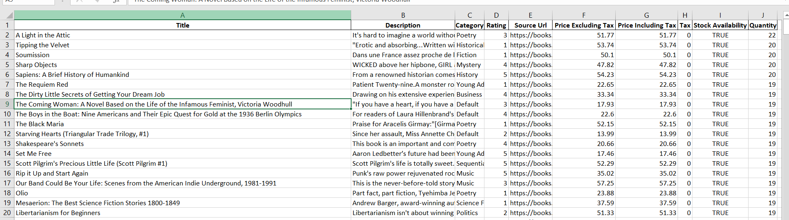
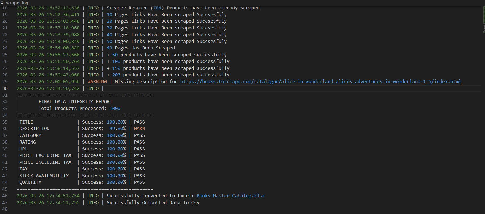

# 📚 High-Integrity Book Catalog Pipeline (1,000+ Products)

### 💰 Business Value
**Bridging the gap between raw web content and structured catalog intelligence.** This pipeline is architected to transform fragmented e-commerce data into a high-fidelity dataset. Designed for market analysts, price monitoring, and inventory benchmarking, this tool implements a **Precision-First** extraction logic, ensuring 100% data accuracy for commercial research purposes.

---

## 🛠️ Tech Stack
* **Engine:** `Python 3.10` utilizing a **Modular Procedural Architecture** for stable execution.
* **Networking:** `Requests` library with integrated custom headers to mimic human-centric browsing patterns.
* **Data Architecture:** `Pandas` for advanced metadata cleaning and dual-format serialization (CSV & Excel).
* **Resilience:** Built-in **Sequential Fault-Tolerance** with professional logging to handle network retries and pagination integrity.

---

## 📊 Dataset Overview (1,000 Products)
The pipeline is engineered to extract **99% of the available catalog attributes** across all 50 pagination levels.

### **Extracted Attributes per Record:**
* **Identity:** Book Title & Full Description.
* **Financials:** Price (formatted) & Tax status.
* **Inventory:** Real-time Stock Availability & Product Type.
* **Reputation:** Star Ratings & Review Count.
* **Metadata:** UPC Codes & Category Tagging.

---

## 🔍 Data Quality & Transparency

### **Primary Data Preview**

> **High-fidelity snapshot showing structural integrity across complex text fields, pricing data, and categorical tagging.**

### **Advanced Integrity Auditing**

> **Operational Transparency:** Features an automated audit system with **Fault-Tolerant Resume** capabilities. The pipeline tracks data density across all fields, confirming a **100% success rate** for critical business metadata.

---

## 🚀 Key Features
* **Modular Design:** Decoupled logic for extraction, cleaning, and export for easy maintenance.
* **Auto-Resume Engine:** Automatically detects existing data to resume extraction from the last successful checkpoint.
* **Data Hygiene:** Automated pipelines to remove noise from descriptions and normalize currency/rating formats.
* **Professional Logging:** Real-time console monitoring providing full visibility into system health and extraction progress.

---

## 🚀 Getting Started

### **1. Clone The Repository**
```
git clone https://github.com/ammar-mostafa-dev/Books-Catalog-Pipeline
cd Books-Catalog-Pipeline
```
### **2. Set Up Virtual Environment ** 
```
python -m venv venv
```

# Activate on Windows:
```
.\venv\Scripts\activate
```

# Activate on macOS/Linux:
```
source venv/bin/activate
```

### **3. Install Dependencies **
```
pip install -r requirements.txt
```

### **4. Run Scraper ** 
```
python main.py
```

---

## 📊 System Outputs
* **Master Catalog:** A professional Excel file (`Books_Master_Catalog.xlsx`).
* **CSV Raw Data:** For seamless integration into Python/R analysis tools.
* **Audit Logs:** A detailed `.log` file documenting every request and extraction event for quality assurance.

---
**Developed by Ammar Mostafa** *Data Extraction Specialist | Building Resilient Lead Gen & Catalog Pipelines* 📧 [ammar.mostafa.dev@gmail.com](mailto:ammar.mostafa.dev@gmail.com)
